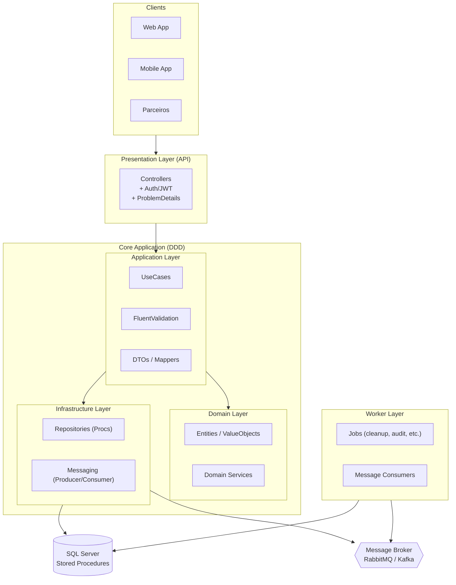
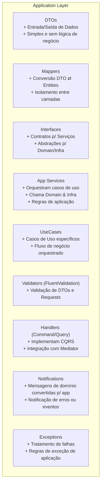

```mermaid

%%{init: {"flowchart": {"htmlLabels": false}} }%%
flowchart TB

  %% === Clientes ===
  subgraph Clients["Clients"]
    Web["Web App"]
    Mobile["Mobile App"]
    Partner["Parceiros"]
  end

  %% === API / Presentation ===
  subgraph Api["Presentation Layer (API)"]
    Controller["Controllers\n+ Auth/JWT\n+ ProblemDetails"]
  end

  %% === Core DDD ===
  subgraph DDD["Core Application (DDD)"]
    subgraph Application["Application Layer"]
      UseCases["UseCases"]
      Validators["FluentValidation"]
      DTOs["DTOs / Mappers"]
    end
    subgraph Domain["Domain Layer"]
      Entities["Entities / ValueObjects"]
      Services["Domain Services"]
    end
    subgraph Infrastructure["Infrastructure Layer"]
      Repos["Repositories (Procs)"]
      Messaging["Messaging (Producer/Consumer)"]
    end
  end

  %% === DB & Broker separados ===
  DB[(SQL Server\nStored Procedures)]
  Broker{{Message Broker\nRabbitMQ / Kafka}}

  %% === Worker ===
  subgraph Worker["Worker Layer"]
    Jobs["Jobs (cleanup, audit, etc.)"]
    Consumer["Message Consumers"]
  end

  %% Fluxos principais
  Clients --> Api
  Api --> Application
  Application --> Domain
  Application --> Infrastructure

  %% Infra saídas paralelas
  Infrastructure --> DB
  Infrastructure --> Broker

  %% Worker conexões (sem cruzar)
  Worker --> DB
  Worker --> Broker


```

#Application Architecture

```mermaid
%%{init: {"flowchart": {"htmlLabels": false}} }%%
flowchart TB

  subgraph Application["Application Layer"]
    DTOs["DTOs\n+ Entrada/Saída de Dados\n+ Simples e sem lógica de negócio"]
    Mappers["Mappers\n+ Conversão DTO ⇄ Entities\n+ Isolamento entre camadas"]
    Interfaces["Interfaces\n+ Contratos p/ Serviços\n+ Abstrações p/ Domain/Infra"]
    Services["App Services\n+ Orquestram casos de uso\n+ Chama Domain & Infra\n+ Regras de aplicação"]
    UseCases["UseCases\n+ Casos de Uso específicos\n+ Fluxo de negócio orquestrado"]
    Validators["Validators (FluentValidation)\n+ Validação de DTOs e Requests"]
    Handlers["Handlers (Command/Query)\n+ Implementam CQRS\n+ Integração com Mediator"]
    Notifications["Notifications\n+ Mensagens de domínio convertidas p/ app\n+ Notificação de erros ou eventos"]
    Exceptions["Exceptions\n+ Tratamento de falhas\n+ Regras de exceção de aplicação"]
  end

```