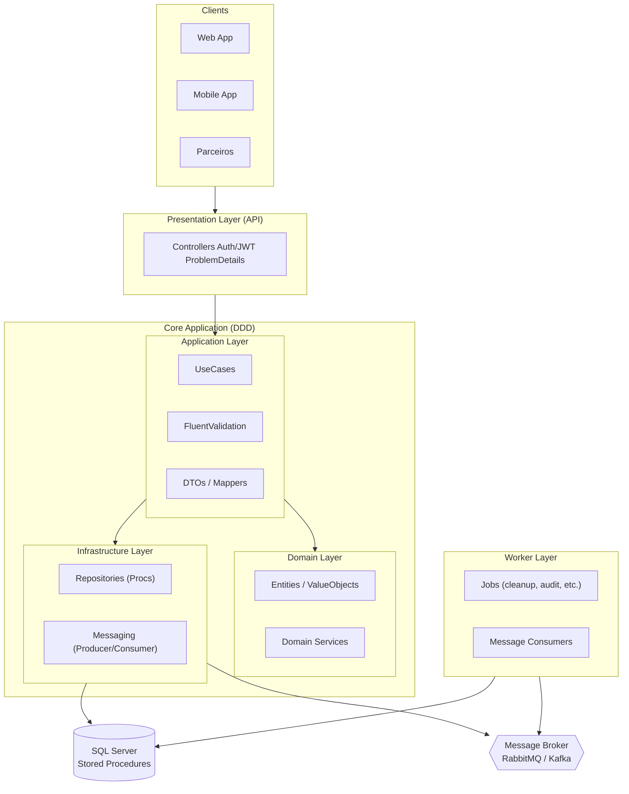
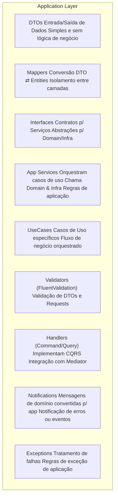

# Application Architecture

# 📂 Estrutura e responsabilidades da Application Layer

## DTOs → Objetos de transporte, usados para entrada (requests) e saída (responses) da API. Não têm lógica de negócio.

## Mappers → Fazem a conversão entre DTOs e Entities (Domain). Garantem isolamento entre camadas.

## Interfaces → Contratos de serviços, que podem ser implementados por Domain ou Infra.

## Services (Application Services) → Contêm a lógica de orquestração dos casos de uso, chamando Domain Services e Infra Repositories.

## UseCases → Representam cenários de negócio específicos (ex: Criar Usuário, Processar Pagamento).

## Validators (FluentValidation) → Validação de DTOs e inputs antes de chegar ao Domain.

## Handlers (CQRS) → Implementação de Commands (escrita) e Queries (leitura), geralmente integrados com MediatR.

## Notifications → Canal para erros, warnings ou eventos que precisam ser propagados.

## Exceptions → Exceções de aplicação, isolando regras de erro que não pertencem ao Domain.