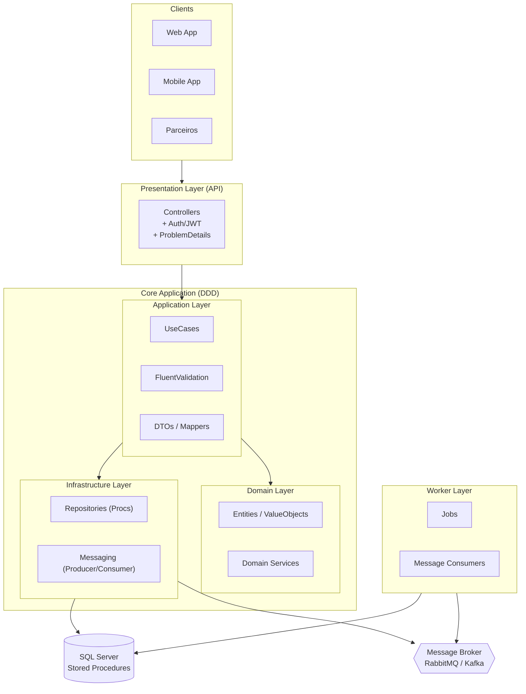

  
---

## 🔑 Detalhes importantes
- O bloco precisa começar com **\`\`\`mermaid** e terminar com **\`\`\`**.  
- A linha `%%{init: ...}%%` é aceita, mas precisa estar **dentro** do bloco.  
- Se deixar fora, o GitHub trata como texto simples (o que aconteceu no seu caso).

---

👉 Faz esse ajuste, commita e atualiza no GitHub. Aí o gráfico vai renderizar no próprio README.  

Quer que eu te monte já um **README.md completo** com o diagrama + árvore de pastas da camada `Application` para você colar direto no repo?
