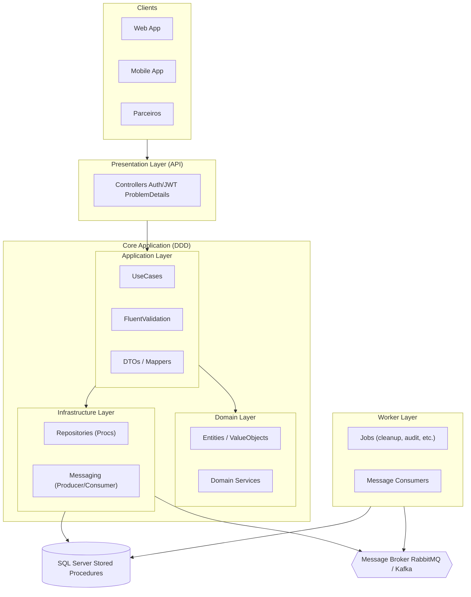

# Application Architecture

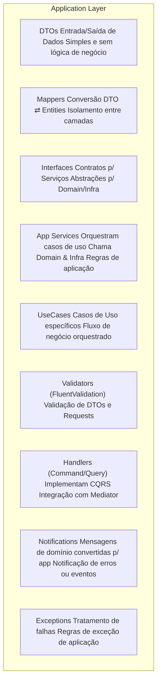

# 📂 Estrutura e responsabilidades da Application Layer

## DTOs → Objetos de transporte, usados para entrada (requests) e saída (responses) da API. Não têm lógica de negócio.

## Mappers → Fazem a conversão entre DTOs e Entities (Domain). Garantem isolamento entre camadas.

## Interfaces → Contratos de serviços, que podem ser implementados por Domain ou Infra.

## Services (Application Services) → Contêm a lógica de orquestração dos casos de uso, chamando Domain Services e Infra Repositories.

## UseCases → Representam cenários de negócio específicos (ex: Criar Usuário, Processar Pagamento).

## Validators (FluentValidation) → Validação de DTOs e inputs antes de chegar ao Domain.

## Handlers (CQRS) → Implementação de Commands (escrita) e Queries (leitura), geralmente integrados com MediatR.

## Notifications → Canal para erros, warnings ou eventos que precisam ser propagados.

## Exceptions → Exceções de aplicação, isolando regras de erro que não pertencem ao Domain.

# Dtos

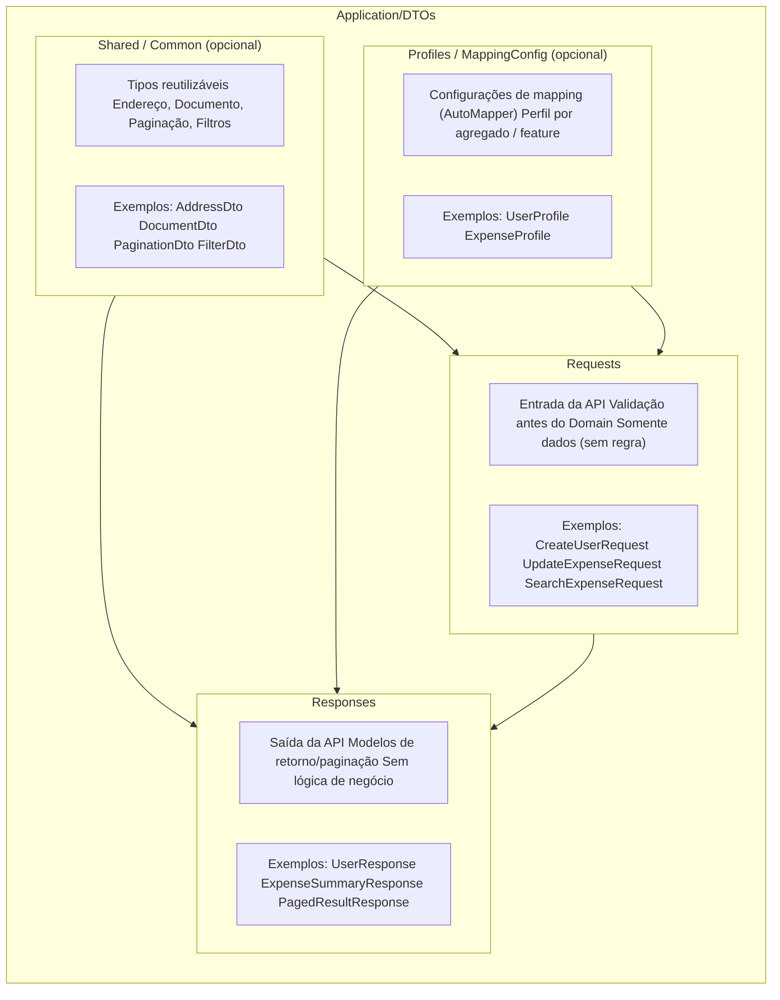

# Mappers

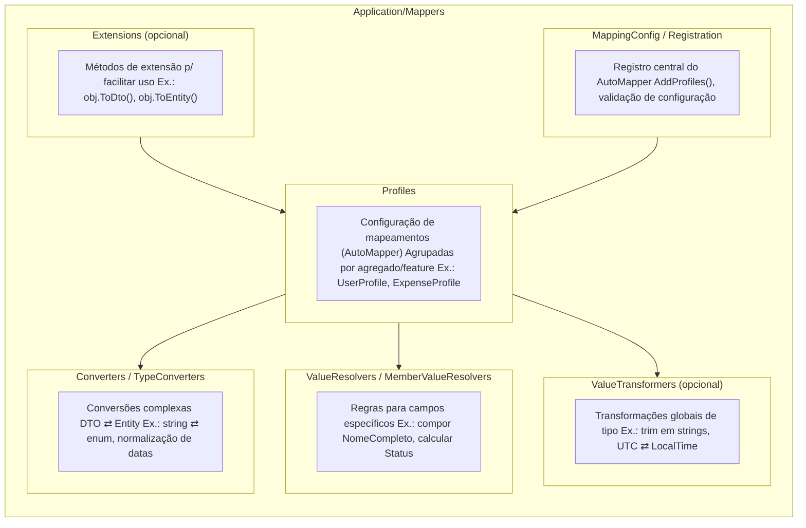


# Interfaces
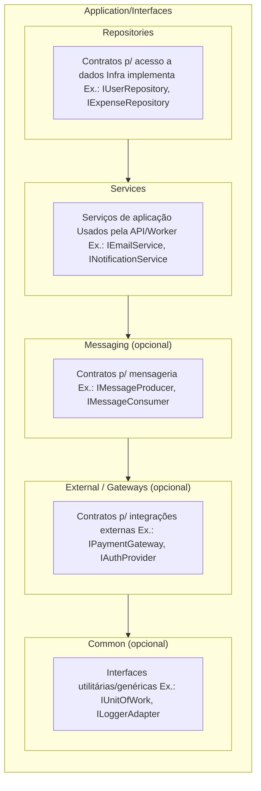

# Services
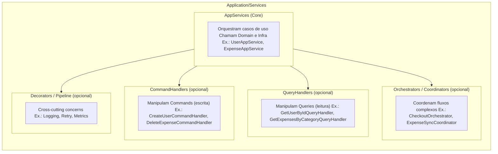

# UseCases
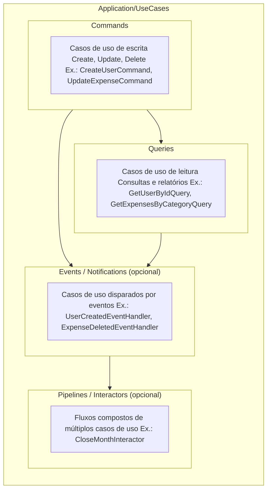

# Validators
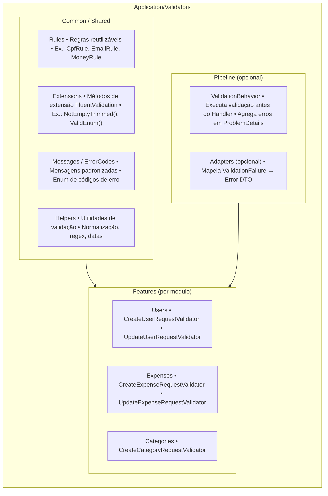

# Handlers
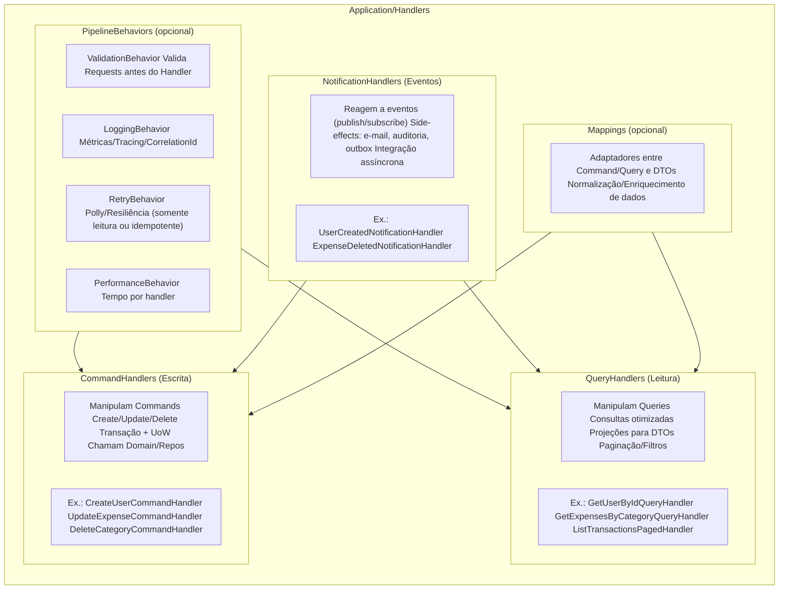

# Notifications
```mermaid
%%{init: {"flowchart": {"htmlLabels": false}} }%%
flowchart TB

  subgraph Notifications["Application/Notifications"]
    direction TB

    subgraph Events["Events (Application/Domain→App)"]
      E_desc["Contratos de eventos/notificações Ex.: UserCreated, ExpenseDeleted"]
    end

    subgraph Publishers["Publishers"]
      P_desc["Publicam notificações (in-proc via MediatR ou outbox → broker) Ex.: NotificationPublisher"]
    end

    subgraph Handlers["Handlers"]
      H_desc["Reagem aos eventos (side-effects) Ex.: enviar e-mail, auditoria, projeções de leitura"]
    end

    subgraph Adapters["Adapters / Translators (opcional)"]
      A_desc["Mapeiam DomainEvent → AppNotification Normalizam payloads para fila/API externa"]
    end

    subgraph Outbox["Outbox (opcional)"]
      O_desc["Tabela de saída transacional Processador de outbox para broker (Rabbit/Kafka)"]
    end

    subgraph Policies["Policies (opcional)"]
      PL_desc["Retry/Backoff/Dead-letter Idempotência e deduplicação"]
    end
  end

  %% Relações
  Events --> Publishers
  Publishers --> Handlers
  Adapters --> Publishers
  Outbox --> Publishers
  Policies --> Handlers
  Policies --> Publishers

  ```

  # Exceptions
  ```mermaid

%%{init: {"flowchart": {"htmlLabels": false}} }%%
flowchart TB

  subgraph Exceptions["Application/Exceptions"]
    direction TB

    subgraph Types["Types"]
      T_desc["Hierarquia de exceções de Aplicação • ApplicationException (base) • ValidationException • NotFoundException • ConflictException • UnauthorizedException • ForbiddenException • BusinessRuleException"]
    end

    subgraph Mapping["Mapping / ProblemDetails"]
      M_desc["Mapeia Exception → ProblemDetails (RFC 7807) • status, type, title, detail, instance • errorCode, traceId, fieldErrors"]
    end

    subgraph Translators["Translators / Adapters"]
      TR_desc["DomainException → ApplicationException InfraException → ApplicationException Normalização e códigos"]
    end

    subgraph Middleware["Middleware / Filters"]
      MW_desc["ExceptionHandlingMiddleware ApiExceptionFilter (opcional) Oculta stack em produção"]
    end

    subgraph Policies["Policies (opcional)"]
      P_desc["Retryable vs NonRetryable Idempotência/CorrelationId Telemetria/Logging"]
    end

    subgraph Codes["ErrorCodes / Messages"]
      C_desc["Enum de códigos Mensagens padronizadas/i18n Catálogo de erros"]
    end
  end

  %% Relações
  Types --> Mapping
  Translators --> Types
  Middleware --> Mapping
  Policies --> Middleware
  Codes --> Mapping

  ```

  # Presentation Layer
```mermaid
%%{init: {"flowchart": {"htmlLabels": false}} }%%
flowchart TB

  subgraph Presentation["Presentation Layer (API)"]
    direction TB

    subgraph Controllers["Controllers"]
      C_desc["Expondo endpoints REST/GraphQL/gRPC Chamam Application Services ou Handlers Ex.: UserController, ExpenseController"]
    end

    subgraph Filters["Filters"]
      F_desc["Filtros de ação e exceção Ex.: ApiExceptionFilter, ValidationFilter"]
    end

    subgraph Middleware["Middleware"]
      M_desc["Pipeline HTTP (Request → Response) Ex.: ExceptionHandlingMiddleware, CorrelationIdMiddleware"]
    end

    subgraph Auth["Auth / Security"]
      A_desc["Autenticação e Autorização Ex.: JWT Bearer, OAuth2, AuthorizationPolicies"]
    end

    subgraph ProblemDetails["ProblemDetails / Error Handling"]
      PD_desc["Padrão RFC 7807 Mapeamento de exceções p/ HTTP Ex.: ProblemDetailsFactory, ValidationProblemDetails"]
    end

    subgraph Config["Config"]
      Co_desc["Configurações auxiliares da API Ex.: SwaggerConfig, ApiVersioningConfig"]
    end
  end

  %% Relações
  Controllers --> Filters
  Controllers --> Middleware
  Controllers --> Auth
  Controllers --> ProblemDetails
  Controllers --> Config
```

# Controller
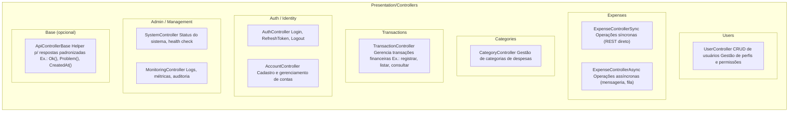

# Filters
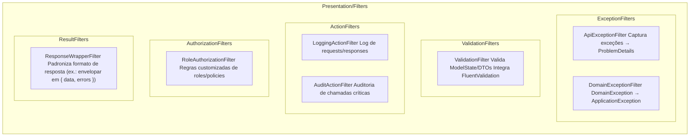

# Middleware
```mermaid
%%{init: {"flowchart": {"htmlLabels": false}} }%%
flowchart TB

  subgraph Middleware["Presentation/Middleware"]
    direction TB

    Ex["ExceptionHandlingMiddleware Captura exceções globais → ProblemDetails"]
    Corr["CorrelationIdMiddleware Gera e propaga CorrelationId p/ rastreamento"]
    Log["LoggingMiddleware Log de Request/Response + Métricas básicas"]
    Time["RequestTimingMiddleware Mede tempo de execução + Telemetria/Tracing"]
    Auth["AuthenticationMiddleware (opcional) Autenticação customizada/OAuth2"]
    Rate["RateLimitingMiddleware (opcional) Controle de chamadas Throttling/Quota"]
    Cache["CachingMiddleware (opcional) Cache de respostas"]
    Sec["SecurityHeadersMiddleware (opcional) Headers de segurança: CSP, CORS, HSTS"]
  end

  ```