📦 src
 ├── Clients
 │    ├── Web
 │    ├── Mobile
 │    └── Partner
 │
 ├── Presentation
 │    ├── Controllers
 │    │    ├── Users
 │    │    ├── Expenses
 │    │    ├── Categories
 │    │    ├── Transactions
 │    │    ├── Auth
 │    │    ├── Admin
 │    │    └── Base
 │    │
 │    ├── Filters
 │    │    ├── ExceptionFilters
 │    │    ├── ValidationFilters
 │    │    ├── ActionFilters
 │    │    ├── AuthorizationFilters
 │    │    └── ResultFilters
 │    │
 │    ├── Middleware
 │    ├── Auth
 │    │    ├── Jwt
 │    │    ├── Policies
 │    │    ├── Claims
 │    │    ├── Identity
 │    │    ├── Providers
 │    │    └── Utils
 │    │
 │    ├── ProblemDetails
 │    │    ├── Factory
 │    │    ├── Mapping
 │    │    ├── Models
 │    │    ├── Writers
 │    │    └── Extensions
 │    │
 │    ├── Admin
 │    │    ├── Controllers
 │    │    ├── Services
 │    │    ├── Auth
 │    │    ├── DTOs
 │    │    └── Filters
 │    │
 │    ├── Models
 │    │    ├── Requests
 │    │    ├── Responses
 │    │    └── Bindings
 │    │
 │    └── Config
 │         ├── Swagger
 │         ├── Versioning
 │         ├── Cors
 │         ├── Json
 │         ├── RateLimiting
 │         └── HealthChecks
 │
 ├── Application
 │    ├── DTOs
 │    │    ├── Requests
 │    │    ├── Responses
 │    │    ├── Shared
 │    │    └── Profiles
 │    │
 │    ├── Mappers
 │    │    ├── Profiles
 │    │    ├── Converters
 │    │    ├── Resolvers
 │    │    ├── Transformers
 │    │    ├── Extensions
 │    │    └── Config
 │    │
 │    ├── Interfaces
 │    │    ├── Repositories
 │    │    ├── Services
 │    │    ├── Messaging
 │    │    ├── External
 │    │    └── Common
 │    │
 │    ├── Services
 │    │    ├── AppServices
 │    │    ├── CommandHandlers
 │    │    ├── QueryHandlers
 │    │    ├── Orchestrators
 │    │    └── Decorators
 │    │
 │    ├── UseCases
 │    │    ├── Commands
 │    │    ├── Queries
 │    │    ├── Events
 │    │    └── Pipelines
 │    │
 │    ├── Validators
 │    │    ├── Features
 │    │    ├── Common
 │    │    └── Pipeline
 │    │
 │    ├── Handlers
 │    │    ├── Commands
 │    │    ├── Queries
 │    │    ├── Notifications
 │    │    ├── Pipeline
 │    │    └── Mappings
 │    │
 │    ├── Notifications
 │    │    ├── Events
 │    │    ├── Publishers
 │    │    ├── Handlers
 │    │    ├── Adapters
 │    │    ├── Outbox
 │    │    └── Policies
 │    │
 │    └── Exceptions
 │         ├── Types
 │         ├── Mapping
 │         ├── Translators
 │         ├── Middleware
 │         ├── Policies
 │         └── Codes
 │
 ├── Domain
 │    ├── Entities
 │    ├── ValueObjects
 │    ├── Services
 │    ├── Events
 │    ├── Specifications
 │    ├── Exceptions
 │    └── Aggregates
 │
 ├── Infrastructure
 │    ├── Repositories
 │    ├── Messaging
 │    ├── Outbox
 │    ├── Persistence
 │    └── Migrations
 │
 └── Worker
      ├── Jobs
      └── Consumers


📦 src
 ├── Clients                          # Camada de clientes que consomem a API
 │    ├── Web                         # Aplicação Web
 │    ├── Mobile                      # Aplicativo Mobile
 │    └── Partner                     # Integrações com sistemas/parceiros externos
 │
 ├── Presentation                     # Camada de apresentação (API / Controllers)
 │    ├── Controllers                 # Endpoints HTTP expostos aos clientes
 │    │    ├── Users                  # Controladores de usuários
 │    │    ├── Expenses               # Controladores de despesas (sync/async)
 │    │    ├── Categories             # Controladores de categorias
 │    │    ├── Transactions           # Controladores de transações financeiras
 │    │    ├── Auth                   # Autenticação/autorização (login, tokens)
 │    │    ├── Admin                  # Endpoints administrativos (monitoramento, jobs)
 │    │    └── Base                   # Controller base com helpers padrão
 │    │
 │    ├── Filters                     # Filtros globais de requisição/resposta
 │    │    ├── ExceptionFilters        # Converte exceções em ProblemDetails
 │    │    ├── ValidationFilters       # Validação de inputs/DTOs
 │    │    ├── ActionFilters           # Logging e auditoria de ações
 │    │    ├── AuthorizationFilters    # Regras de autorização customizadas
 │    │    └── ResultFilters           # Padroniza formato das respostas
 │    │
 │    ├── Middleware                  # Pipeline HTTP (logging, exceptions, tracing)
 │    │
 │    ├── Auth                        # Configuração de autenticação/autorização
 │    │    ├── Jwt                     # Configuração JWT (tokens)
 │    │    ├── Policies                # Regras de acesso (roles, claims)
 │    │    ├── Claims                  # Extensões e tipos de claims
 │    │    ├── Identity                # Integração com ASP.NET Identity
 │    │    ├── Providers               # Login externo (Google, MS, Facebook)
 │    │    └── Utils                   # Utilidades de segurança (hash, validação)
 │    │
 │    ├── ProblemDetails              # Padronização de erros (RFC 7807)
 │    │    ├── Factory                 # Criação de objetos ProblemDetails
 │    │    ├── Mapping                 # Mapeia exceptions → problem types
 │    │    ├── Models                  # Estruturas extendidas de erros
 │    │    ├── Writers                 # Escrita serializada (JSON)
 │    │    └── Extensions              # Helpers e extensões de contexto
 │    │
 │    ├── Admin                       # APIs administrativas/operacionais
 │    │    ├── Controllers             # HealthCheck, Monitoramento, Jobs
 │    │    ├── Services                # Serviços de diagnóstico e info de build
 │    │    ├── Auth                    # Regras extras de autenticação admin
 │    │    ├── DTOs                    # Modelos de resposta de health/build
 │    │    └── Filters                 # Auditoria de ações administrativas
 │    │
 │    ├── Models                      # Modelos de binding (entrada/saída da API)
 │    │    ├── Requests                # Modelos de entrada (POST/PUT)
 │    │    ├── Responses               # Modelos de saída (GET/DTOs de retorno)
 │    │    └── Bindings                # Model binders customizados (arquivos, CSV)
 │    │
 │    └── Config                      # Configurações auxiliares
 │         ├── Swagger                 # Documentação OpenAPI
 │         ├── Versioning              # Versionamento da API
 │         ├── Cors                    # Políticas CORS
 │         ├── Json                    # Serialização JSON
 │         ├── RateLimiting            # Limite de requisições
 │         └── HealthChecks            # Configuração de health checks
 │
 ├── Application                      # Camada de aplicação (regras de orquestração)
 │    ├── DTOs                        # Objetos de transporte (entrada/saída)
 │    │    ├── Requests                # DTOs de entrada
 │    │    ├── Responses               # DTOs de saída
 │    │    ├── Shared                  # DTOs comuns/reutilizáveis
 │    │    └── Profiles                # Perfis de mapeamento (AutoMapper)
 │    │
 │    ├── Mappers                     # Conversão entre DTOs e Entities
 │    │    ├── Profiles                # Configurações de mapping
 │    │    ├── Converters              # Conversões complexas
 │    │    ├── Resolvers               # Resolvedores de propriedades
 │    │    ├── Transformers            # Transformações globais
 │    │    ├── Extensions              # Métodos de extensão de mapping
 │    │    └── Config                  # Registro de perfis
 │    │
 │    ├── Interfaces                  # Contratos da camada Application
 │    │    ├── Repositories            # Interfaces de persistência
 │    │    ├── Services                # Interfaces de serviços de aplicação
 │    │    ├── Messaging               # Interfaces de mensageria
 │    │    ├── External                # Integrações externas (gateways)
 │    │    └── Common                  # Interfaces utilitárias
 │    │
 │    ├── Services                    # Serviços de aplicação
 │    │    ├── AppServices             # Orquestram casos de uso
 │    │    ├── CommandHandlers         # Manipulam Commands (escrita)
 │    │    ├── QueryHandlers           # Manipulam Queries (leitura)
 │    │    ├── Orchestrators           # Coordenam fluxos complexos
 │    │    └── Decorators              # Cross-cutting concerns (logging, retry)
 │    │
 │    ├── UseCases                    # Casos de uso específicos
 │    │    ├── Commands                # Ações de escrita (criar/atualizar/excluir)
 │    │    ├── Queries                 # Consultas/leitura
 │    │    ├── Events                  # Casos disparados por eventos
 │    │    └── Pipelines               # Fluxos que agrupam múltiplos casos
 │    │
 │    ├── Validators                  # Validação de DTOs e requests
 │    │    ├── Features                # Validadores por módulo/feature
 │    │    ├── Common                  # Regras compartilhadas
 │    │    └── Pipeline                # Behaviors de validação em CQRS
 │    │
 │    ├── Handlers                    # Manipuladores CQRS
 │    │    ├── Commands                # Manipuladores de escrita
 │    │    ├── Queries                 # Manipuladores de leitura
 │    │    ├── Notifications           # Manipuladores de eventos
 │    │    ├── Pipeline                # Pipeline behaviors (validação, log, retry)
 │    │    └── Mappings                # Adaptação Command/Query ⇄ DTO
 │    │
 │    ├── Notifications               # Eventos/notificações de aplicação
 │    │    ├── Events                  # Definição dos eventos
 │    │    ├── Publishers              # Publicadores de eventos
 │    │    ├── Handlers                # Manipuladores dos eventos
 │    │    ├── Adapters                # Adaptação de eventos de domínio
 │    │    ├── Outbox                  # Implementação do Outbox pattern
 │    │    └── Policies                # Políticas de retry, idempotência
 │    │
 │    └── Exceptions                  # Exceções de aplicação
 │         ├── Types                   # Tipos de exceções
 │         ├── Mapping                 # Mapeamento para ProblemDetails
 │         ├── Translators             # Tradução Domain/Infra → Application
 │         ├── Middleware              # Tratamento centralizado
 │         ├── Policies                # Políticas de erros
 │         └── Codes                   # Catálogo de códigos/mensagens
 │
 ├── Domain                           # Camada de domínio (regras de negócio puras)
 │    ├── Entities                    # Entidades com identidade própria
 │    ├── ValueObjects                # Objetos de valor (imutáveis, sem identidade)
 │    ├── Services                    # Serviços de domínio (regras de negócio complexas)
 │    ├── Events                      # Eventos de domínio
 │    ├── Specifications              # Regras de negócio encapsuladas
 │    ├── Exceptions                  # Exceções de domínio
 │    └── Aggregates                  # Raízes de agregados e seus limites
 │
 ├── Infrastructure                   # Camada de infraestrutura (implementações técnicas)
 │    ├── Repositories                # Implementação de repositórios (SQL/NoSQL/Procs)
 │    ├── Messaging                   # Implementação de filas e mensageria
 │    ├── Outbox                      # Processamento de mensagens persistidas (Outbox)
 │    ├── Persistence                 # DbContext, conexões, unidade de trabalho
 │    └── Migrations                  # Scripts/migrações de banco
 │
 └── Worker                           # Processos assíncronos / background
      ├── Jobs                        # Tarefas agendadas (limpeza, auditoria, batch)
      └── Consumers                   # Consumidores de mensagens (RabbitMQ/Kafka)


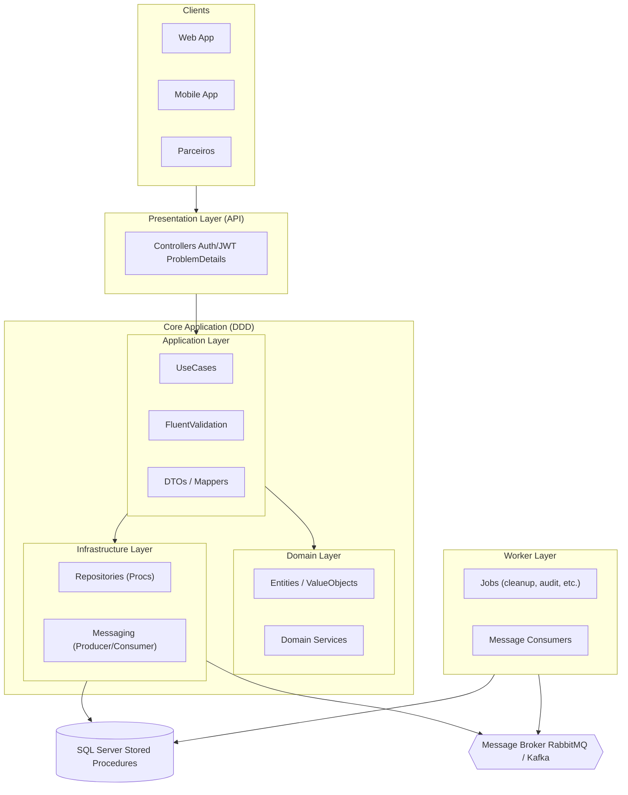

# Application Architecture

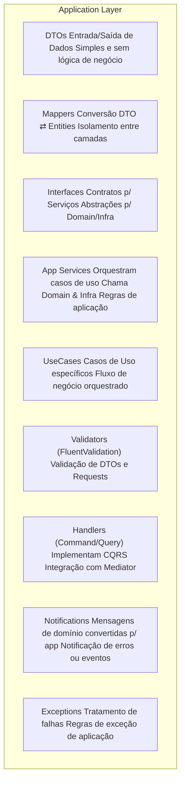

# 📂 Estrutura e responsabilidades da Application Layer

## DTOs → Objetos de transporte, usados para entrada (requests) e saída (responses) da API. Não têm lógica de negócio.

## Mappers → Fazem a conversão entre DTOs e Entities (Domain). Garantem isolamento entre camadas.

## Interfaces → Contratos de serviços, que podem ser implementados por Domain ou Infra.

## Services (Application Services) → Contêm a lógica de orquestração dos casos de uso, chamando Domain Services e Infra Repositories.

## UseCases → Representam cenários de negócio específicos (ex: Criar Usuário, Processar Pagamento).

## Validators (FluentValidation) → Validação de DTOs e inputs antes de chegar ao Domain.

## Handlers (CQRS) → Implementação de Commands (escrita) e Queries (leitura), geralmente integrados com MediatR.

## Notifications → Canal para erros, warnings ou eventos que precisam ser propagados.

## Exceptions → Exceções de aplicação, isolando regras de erro que não pertencem ao Domain.

# Dtos

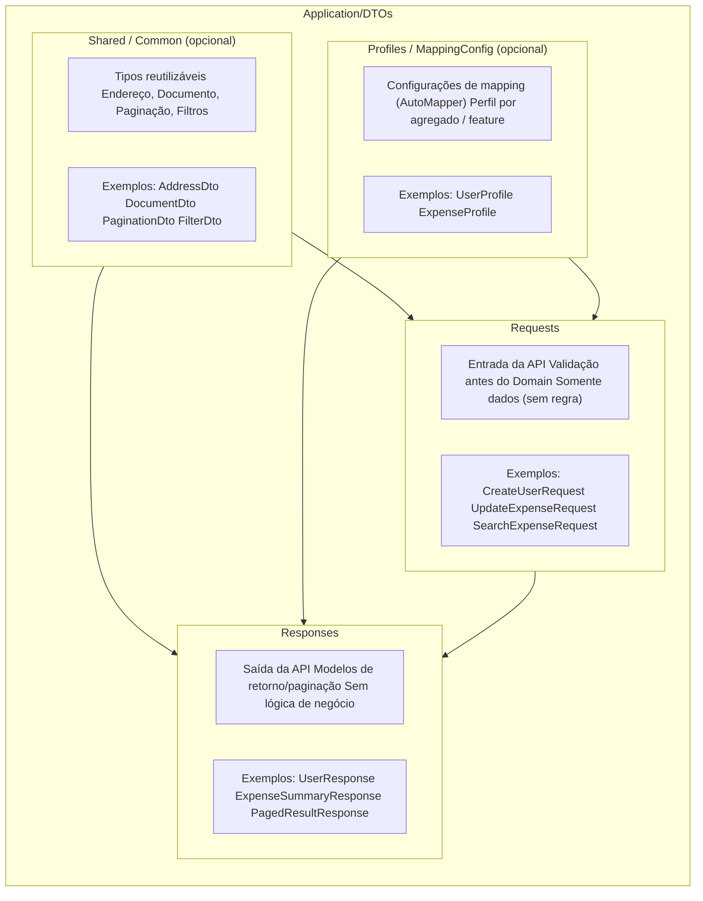

# Mappers

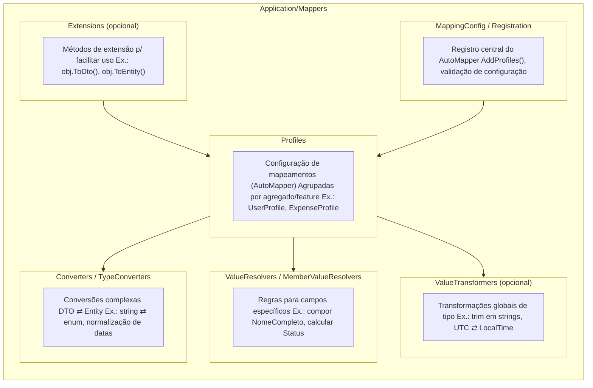


# Interfaces
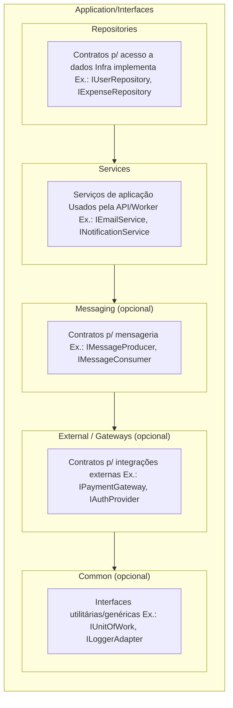

# Services
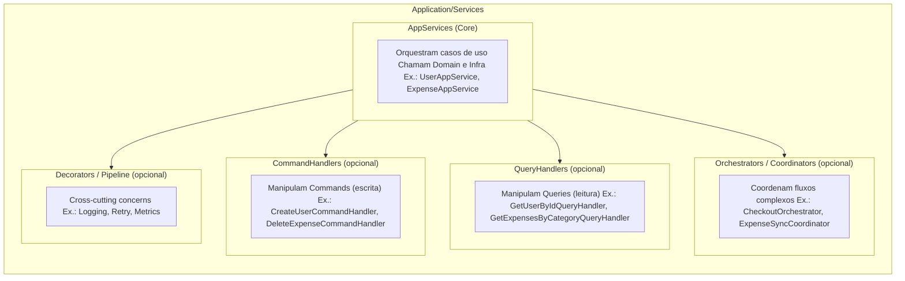

# UseCases
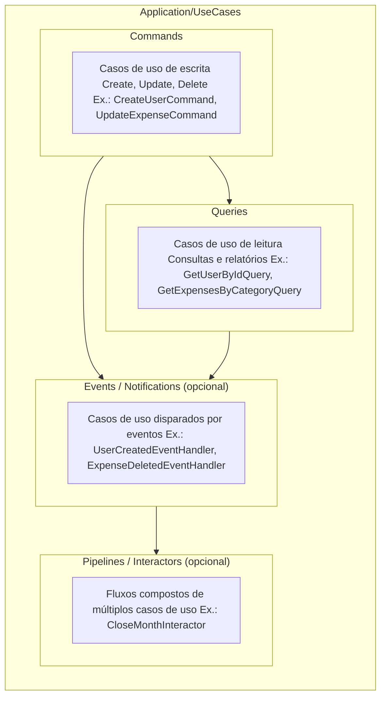

# Validators
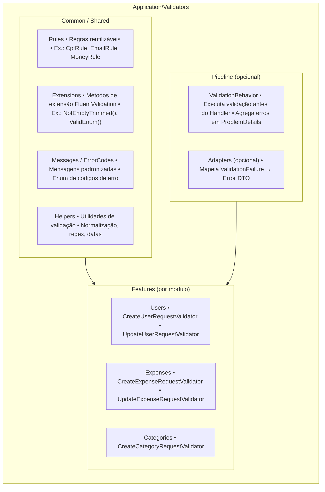

# Handlers
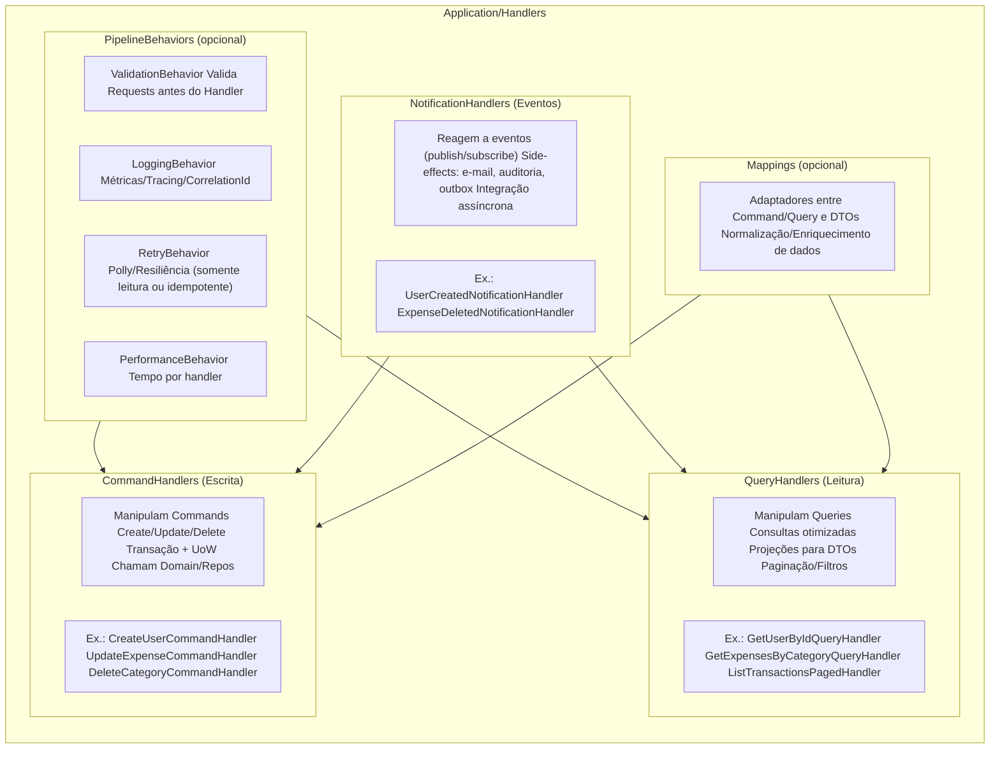

# Notifications
```mermaid
%%{init: {"flowchart": {"htmlLabels": false}} }%%
flowchart TB

  subgraph Notifications["Application/Notifications"]
    direction TB

    subgraph Events["Events (Application/Domain→App)"]
      E_desc["Contratos de eventos/notificações Ex.: UserCreated, ExpenseDeleted"]
    end

    subgraph Publishers["Publishers"]
      P_desc["Publicam notificações (in-proc via MediatR ou outbox → broker) Ex.: NotificationPublisher"]
    end

    subgraph Handlers["Handlers"]
      H_desc["Reagem aos eventos (side-effects) Ex.: enviar e-mail, auditoria, projeções de leitura"]
    end

    subgraph Adapters["Adapters / Translators (opcional)"]
      A_desc["Mapeiam DomainEvent → AppNotification Normalizam payloads para fila/API externa"]
    end

    subgraph Outbox["Outbox (opcional)"]
      O_desc["Tabela de saída transacional Processador de outbox para broker (Rabbit/Kafka)"]
    end

    subgraph Policies["Policies (opcional)"]
      PL_desc["Retry/Backoff/Dead-letter Idempotência e deduplicação"]
    end
  end

  %% Relações
  Events --> Publishers
  Publishers --> Handlers
  Adapters --> Publishers
  Outbox --> Publishers
  Policies --> Handlers
  Policies --> Publishers

  ```

  # Exceptions
  ```mermaid

%%{init: {"flowchart": {"htmlLabels": false}} }%%
flowchart TB

  subgraph Exceptions["Application/Exceptions"]
    direction TB

    subgraph Types["Types"]
      T_desc["Hierarquia de exceções de Aplicação • ApplicationException (base) • ValidationException • NotFoundException • ConflictException • UnauthorizedException • ForbiddenException • BusinessRuleException"]
    end

    subgraph Mapping["Mapping / ProblemDetails"]
      M_desc["Mapeia Exception → ProblemDetails (RFC 7807) • status, type, title, detail, instance • errorCode, traceId, fieldErrors"]
    end

    subgraph Translators["Translators / Adapters"]
      TR_desc["DomainException → ApplicationException InfraException → ApplicationException Normalização e códigos"]
    end

    subgraph Middleware["Middleware / Filters"]
      MW_desc["ExceptionHandlingMiddleware ApiExceptionFilter (opcional) Oculta stack em produção"]
    end

    subgraph Policies["Policies (opcional)"]
      P_desc["Retryable vs NonRetryable Idempotência/CorrelationId Telemetria/Logging"]
    end

    subgraph Codes["ErrorCodes / Messages"]
      C_desc["Enum de códigos Mensagens padronizadas/i18n Catálogo de erros"]
    end
  end

  %% Relações
  Types --> Mapping
  Translators --> Types
  Middleware --> Mapping
  Policies --> Middleware
  Codes --> Mapping

  ```

  # Presentation Layer
```mermaid
%%{init: {"flowchart": {"htmlLabels": false}} }%%
flowchart TB

  subgraph Presentation["Presentation Layer (API)"]
    direction TB

    subgraph Controllers["Controllers"]
      C_desc["Expondo endpoints REST/GraphQL/gRPC Chamam Application Services ou Handlers Ex.: UserController, ExpenseController"]
    end

    subgraph Filters["Filters"]
      F_desc["Filtros de ação e exceção Ex.: ApiExceptionFilter, ValidationFilter"]
    end

    subgraph Middleware["Middleware"]
      M_desc["Pipeline HTTP (Request → Response) Ex.: ExceptionHandlingMiddleware, CorrelationIdMiddleware"]
    end

    subgraph Auth["Auth / Security"]
      A_desc["Autenticação e Autorização Ex.: JWT Bearer, OAuth2, AuthorizationPolicies"]
    end

    subgraph ProblemDetails["ProblemDetails / Error Handling"]
      PD_desc["Padrão RFC 7807 Mapeamento de exceções p/ HTTP Ex.: ProblemDetailsFactory, ValidationProblemDetails"]
    end

    subgraph Config["Config"]
      Co_desc["Configurações auxiliares da API Ex.: SwaggerConfig, ApiVersioningConfig"]
    end
  end

  %% Relações
  Controllers --> Filters
  Controllers --> Middleware
  Controllers --> Auth
  Controllers --> ProblemDetails
  Controllers --> Config
```

# Controller
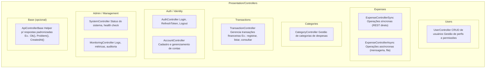

# Filters
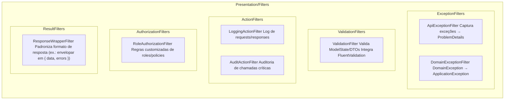

# Middleware
```mermaid
%%{init: {"flowchart": {"htmlLabels": false}} }%%
flowchart TB

  subgraph Middleware["Presentation/Middleware"]
    direction TB

    Ex["ExceptionHandlingMiddleware Captura exceções globais → ProblemDetails"]
    Corr["CorrelationIdMiddleware Gera e propaga CorrelationId p/ rastreamento"]
    Log["LoggingMiddleware Log de Request/Response + Métricas básicas"]
    Time["RequestTimingMiddleware Mede tempo de execução + Telemetria/Tracing"]
    Auth["AuthenticationMiddleware (opcional) Autenticação customizada/OAuth2"]
    Rate["RateLimitingMiddleware (opcional) Controle de chamadas Throttling/Quota"]
    Cache["CachingMiddleware (opcional) Cache de respostas"]
    Sec["SecurityHeadersMiddleware (opcional) Headers de segurança: CSP, CORS, HSTS"]
  end

  ```

  # Auth / Security
```mermaid
  %%{init: {"flowchart": {"htmlLabels": false}} }%%
flowchart TB

  subgraph Auth["Presentation/Auth"]
    direction TB

    subgraph Jwt["JWT"]
      J1["JwtAuthenticationConfig Configurações (Issuer, Audience, SigningKey)"]
      J2["JwtTokenService Geração e validação de tokens"]
      J3["JwtBearerEventsHandler Eventos do pipeline JWT (OnTokenValidated etc.)"]
    end

    subgraph Policies["Authorization Policies"]
      P1["AuthorizationPolicies Regras baseadas em Roles/Claims/Scopes"]
      P2["PolicyNames Constantes com nomes de políticas"]
    end

    subgraph Claims["Claims"]
      C1["ClaimsExtensions Helpers p/ extrair claims do usuário"]
      C2["ClaimTypesCustom Definição de claims customizadas"]
    end

    subgraph Identity["Identity (opcional)"]
      I1["IdentityConfig Configuração ASP.NET Identity"]
      I2["ApplicationUser Usuário customizado com propriedades extras"]
    end

    subgraph Providers["External Providers (opcional)"]
      PR1["OAuth2ProviderConfig Integração com Google, Microsoft, Facebook"]
      PR2["ExternalLoginService Serviço de login via provedores externos"]
    end

    subgraph Utils["Utils"]
      U1["PasswordHasher Hash/Salt seguro p/ senhas"]
      U2["TokenValidationParametersFactory Configuração centralizada p/ validação de tokens"]
    end
  end
  ```
  # ProblemDetails
  ```mermaid
  %%{init: {"flowchart": {"htmlLabels": false}} }%%
flowchart TB

  subgraph ProblemDetails["Presentation/ProblemDetails"]
    direction TB

    subgraph Factory["Factory"]
      F1["ProblemDetailsFactory Cria ProblemDetails/ValidationProblemDetails"]
      F2["ProblemDetailsOptions Mapa status→type/title, env, links"]
    end

    subgraph Mapping["Mapping"]
      M1["ExceptionToProblemDetailsMapper Exception → ProblemDetails"]
      M2["ErrorCodeToProblemTypeMapper ErrorCode → type (URI), title"]
    end

    subgraph Models["Models"]
      Md1["ExtendedProblemDetails + traceId, errorCode, instance, details"]
      Md2["ValidationProblemDetailsEx + fieldErrors (FluentValidation)"]
    end

    subgraph Writers["Writers"]
      W1["ProblemDetailsWriter Serialização: content-type, casing, RFC7807"]
    end

    subgraph Extensions["Extensions"]
      E1["HttpContextProblemExtensions Add traceId/instance/links"]
      E2["ProblemDetailsExtensions Append metadados/códigos"]
    end
  end

  %% Relações
  Factory --> Mapping
  Mapping --> Models
  Writers --> Models
  Extensions --> Factory
  Extensions --> Writers

  ```

  # Admin / Management
  ```mermaid
  %%{init: {"flowchart": {"htmlLabels": false}} }%%
flowchart TB

  subgraph Admin["Presentation/Admin"]
    direction TB

    subgraph Controllers["Controllers"]
      Sys["SystemController Health, uptime, build info"]
      Mon["MonitoringController Métricas/Tracing/Logs (views)"]
      Dia["DiagnosticsController Dumps, threads, GC (restrito)"]
      Jobs["JobsController Disparo de jobs/reprocessos (auditado)"]
    end

    subgraph Services["Services"]
      Hc["HealthCheckService Aggrega IHealthChecks e dependências"]
      Dx["DiagnosticsService GC/Threads/Memory/Process info"]
      Build["BuildInfoProvider Versão/commit/data/env"]
    end

    subgraph Auth["Auth"]
      Pol["AdminAuthorizationPolicy Role/Claim obrigatória"]
      Key["ApiKeyValidator (opcional) Dupla verificação p/ rotas sensíveis"]
    end

    subgraph DTOs["DTOs"]
      Hdto["HealthReportDto"]
      Bdto["BuildInfoDto"]
      Jreq["JobTriggerRequest"]
    end

    subgraph Filters["Filters"]
      Aud["AdminAuditActionFilter Auditoria de ações administrativas"]
    end
  end

  %% Relações
  Controllers --> Services
  Controllers --> Auth
  Controllers --> DTOs
  Controllers --> Filters
  ```

# Models

```mermaid
%%{init: {"flowchart": {"htmlLabels": false}} }%%
flowchart TB

  subgraph Models["Presentation/Models"]
    direction TB

    subgraph Requests["Requests"]
      R_auth["Auth LoginModel RefreshTokenModel"]
      R_users["Users CreateUserModel UpdateUserModel"]
      R_exp["Expenses CreateExpenseModel ImportExpensesCsvModel"]
      R_common["Common PaginationModel DateRangeModel"]
    end

    subgraph Responses["Responses"]
      S_users["Users UserViewModel"]
      S_exp["Expenses ExpenseViewModel ExpenseSummaryViewModel"]
      S_common["Common PagedResultModel"]
    end

    subgraph Bindings["Bindings (opcional)"]
      B_custom["CustomModelBinders Enums, datas, CSV"]
      B_multipart["MultipartFormBinders Upload de arquivos"]
    end
  end

  %% Relações
  Requests --> Responses
  Bindings --> Requests
  ```

  # Config
  ```mermaid
  %%{init: {"flowchart": {"htmlLabels": false}} }%%
flowchart TB

  subgraph Config["Presentation/Config"]
    direction TB

    subgraph Swagger["Swagger / OpenAPI"]
      Sw1["SwaggerConfig Setup UI/Docs"]
      Sw2["SwaggerAuthConfig JWT/OAuth2 no Swagger"]
    end

    subgraph Versioning["Versioning"]
      V1["ApiVersioningConfig Configura versões v1, v2..."]
      V2["ApiExplorerConfig Integra com Swagger"]
    end

    subgraph Cors["CORS"]
      C1["CorsConfig Define políticas de origem"]
    end

    subgraph Json["JSON Serialization"]
      J1["JsonOptionsConfig Config System.Text.Json/Newtonsoft"]
      J2["ProblemDetailsConfig Config RFC7807 p/ erros"]
    end

    subgraph Rate["RateLimiting (opcional)"]
      R1["RateLimitingConfig Restrição de requisições"]
    end

    subgraph Health["HealthChecks (opcional)"]
      H1["HealthChecksConfig Registra checks p/ readiness/liveness"]
    end
  end
  ```

  # Domain Layer
```mermaid
  %%{init: {"flowchart": {"htmlLabels": false}} }%%
flowchart TB

  subgraph Domain["Domain Layer"]
    direction TB

    subgraph Entities["Entities"]
      E1["User"]
      E2["Expense"]
      E3["Transaction"]
      E4["Category"]
    end

    subgraph ValueObjects["ValueObjects"]
      V1["Money"]
      V2["Email"]
      V3["Document (CPF/CNPJ)"]
      V4["DateRange"]
    end

    subgraph Services["Domain Services"]
      S1["ExpenseDomainService"]
      S2["TransactionDomainService"]
    end

    subgraph Events["Domain Events"]
      Ev1["UserCreatedDomainEvent"]
      Ev2["ExpenseDeletedDomainEvent"]
    end

    subgraph Specifications["Specifications (opcional)"]
      Sp1["ExpenseOverLimitSpec"]
      Sp2["ActiveUserSpec"]
    end

    subgraph Exceptions["Exceptions"]
      Ex1["DomainException"]
      Ex2["InvalidMoneyException"]
    end

    subgraph Aggregates["Aggregates"]
      Ag1["ExpenseAggregate"]
      Ag2["TransactionAggregate"]
    end
  end

  %% Relações
  Entities --> ValueObjects
  Entities --> Events
  Aggregates --> Entities
  Services --> Entities
  Services --> ValueObjects
  Specifications --> Entities
  Exceptions --> Entities
  
  ```

  # resumo
```mermaid
%%{init: {"flowchart": {"htmlLabels": false}} }%%
flowchart TB

  %% ==== Clients ====
  subgraph Clients["Clients"]
    direction TB
    Web["Web App"]
    Mobile["Mobile App"]
    Partner["Parceiros"]
  end

  %% ==== Presentation Layer ====
  subgraph Presentation["Presentation Layer (API)"]
    direction TB

    subgraph Controllers["Controllers"]
      C_Users["Users UserController"]
      C_Expenses["Expenses ExpenseControllerSync ExpenseControllerAsync"]
      C_Categories["Categories CategoryController"]
      C_Transactions["Transactions TransactionController"]
      C_Auth["Auth AuthController AccountController"]
      C_Admin["Admin SystemController MonitoringController DiagnosticsController JobsController"]
      C_Base["Base (opcional) ApiControllerBase"]
    end

    subgraph Filters["Filters"]
      F_Exception["ExceptionFilters ApiExceptionFilter DomainExceptionFilter"]
      F_Validation["ValidationFilters ValidationFilter"]
      F_Action["ActionFilters LoggingActionFilter AuditActionFilter"]
      F_Author["AuthorizationFilters RoleAuthorizationFilter"]
      F_Result["ResultFilters ResponseWrapperFilter"]
    end

    subgraph Middleware["Middleware"]
      MW_Exception["ExceptionHandlingMiddleware"]
      MW_Corr["CorrelationIdMiddleware"]
      MW_Log["LoggingMiddleware"]
      MW_Time["RequestTimingMiddleware"]
      MW_Auth["AuthenticationMiddleware (opcional)"]
      MW_Rate["RateLimitingMiddleware (opcional)"]
      MW_Cache["CachingMiddleware (opcional)"]
      MW_Sec["SecurityHeadersMiddleware (opcional)"]
    end

    subgraph Auth["Auth / Security"]
      A_Jwt["JWT JwtAuthenticationConfig JwtTokenService JwtBearerEventsHandler"]
      A_Policies["Policies AuthorizationPolicies PolicyNames"]
      A_Claims["Claims ClaimsExtensions ClaimTypesCustom"]
      A_Identity["Identity (opcional) IdentityConfig ApplicationUser"]
      A_Providers["External Providers (opcional) OAuth2ProviderConfig ExternalLoginService"]
      A_Utils["Utils PasswordHasher TokenValidationParametersFactory"]
    end

    subgraph ProblemDetails["ProblemDetails (RFC 7807)"]
      PD_Factory["Factory ProblemDetailsFactory ProblemDetailsOptions"]
      PD_Mapping["Mapping ExceptionToProblemDetailsMapper ErrorCodeToProblemTypeMapper"]
      PD_Models["Models ExtendedProblemDetails ValidationProblemDetailsEx"]
      PD_Writers["Writers ProblemDetailsWriter"]
      PD_Ext["Extensions HttpContextProblemExtensions ProblemDetailsExtensions"]
    end

    subgraph Admin["Admin"]
      ADT_DTOs["DTOs HealthReportDto BuildInfoDto JobTriggerRequest"]
      ADT_Services["Services HealthCheckService DiagnosticsService BuildInfoProvider"]
      ADT_Auth["Auth AdminAuthorizationPolicy ApiKeyValidator"]
      ADT_Filters["Filters AdminAuditActionFilter"]
    end

    subgraph Models["Models (opcional)"]
      M_Req["Requests Auth: LoginModel, RefreshTokenModel Users: Create/UpdateUserModel Expenses: CreateExpenseModel, ImportExpensesCsvModel Common: PaginationModel, DateRangeModel"]
      M_Res["Responses Users: UserViewModel Expenses: ExpenseViewModel, ExpenseSummaryViewModel Common: PagedResultModel"]
      M_Bind["Bindings CustomModelBinders MultipartFormBinders"]
    end

    subgraph Config["Config"]
      CFG_Swagger["Swagger SwaggerConfig SwaggerAuthConfig"]
      CFG_Version["Versioning ApiVersioningConfig ApiExplorerConfig"]
      CFG_Cors["CORS CorsConfig"]
      CFG_Json["JSON JsonOptionsConfig ProblemDetailsConfig"]
      CFG_Rate["RateLimiting (opcional) RateLimitingConfig"]
      CFG_Health["HealthChecks (opcional) HealthChecksConfig"]
    end
  end

  %% ==== Application Layer ====
  subgraph Application["Application Layer"]
    direction TB

    subgraph DTOs["DTOs"]
      D_Req["Requests"]
      D_Res["Responses"]
      D_Shared["Shared / Common"]
      D_Profiles["Profiles / MappingConfig (opcional)"]
    end

    subgraph Mappers["Mappers"]
      MAP_Profiles["Profiles"]
      MAP_Conv["Converters / TypeConverters"]
      MAP_Res["Resolvers"]
      MAP_Transf["Transformers (opcional)"]
      MAP_Ext["Extensions (opcional)"]
      MAP_Config["MappingConfig / Registration"]
    end

    subgraph Interfaces["Interfaces"]
      I_Repos["Repositories"]
      I_Services["Services"]
      I_Msg["Messaging (opcional)"]
      I_Ext["External / Gateways (opcional)"]
      I_Common["Common (opcional) IUnitOfWork ILoggerAdapter"]
    end

    subgraph Services["Services"]
      S_App["AppServices (Core)"]
      S_CmdH["CommandHandlers (opcional)"]
      S_QryH["QueryHandlers (opcional)"]
      S_Orch["Orchestrators (opcional)"]
      S_Deco["Decorators / Pipeline (opcional)"]
    end

    subgraph UseCases["UseCases"]
      UC_Cmd["Commands"]
      UC_Qry["Queries"]
      UC_Evt["Events / Notifications (opcional)"]
      UC_Pipe["Pipelines / Interactors (opcional)"]
    end

    subgraph Validators["Validators"]
      V_Features["Features (por módulo) Users/Expenses/Categories ..."]
      V_Common["Common / Shared Rules Extensions Messages Helpers"]
      V_Beh["Pipeline (opcional) ValidationBehavior ValidationFailureAdapter"]
    end

    subgraph Handlers["Handlers (CQRS)"]
      H_Cmd["CommandHandlers (Escrita)"]
      H_Qry["QueryHandlers (Leitura)"]
      H_Notif["NotificationHandlers (Eventos)"]
      H_Pipe["PipelineBehaviors (opcional) Validation/Logging/Retry/Performance"]
      H_Map["Mappings (opcional)"]
    end

    subgraph Notifications["Notifications"]
      N_Evt["Events"]
      N_Pub["Publishers"]
      N_Hdl["Handlers"]
      N_Adp["Adapters / Translators (opcional)"]
      N_Out["Outbox (opcional)"]
      N_Pol["Policies (opcional)"]
    end

    subgraph Exceptions["Exceptions"]
      E_Types["Types ApplicationException base Validation/NotFound/Conflict/Unauthorized/Forbidden/BusinessRule"]
      E_Map["Mapping / ProblemDetails"]
      E_Tr["Translators Domain/Infra → Application"]
      E_MW["Middleware / Filters"]
      E_Pol["Policies (opcional)"]
      E_Codes["ErrorCodes / Messages"]
    end
  end

  %% ==== Domain Layer ====
  subgraph Domain["Domain Layer"]
    direction TB
    D_Entities["Entities User Expense Transaction Category"]
    D_VO["ValueObjects Money Email Document (CPF/CNPJ) DateRange"]
    D_Services["Domain Services ExpenseDomainService TransactionDomainService"]
    D_Events["Domain Events UserCreatedDomainEvent ExpenseDeletedDomainEvent"]
    D_Specs["Specifications (opcional) ExpenseOverLimitSpec ActiveUserSpec"]
    D_Ex["Exceptions DomainException InvalidMoneyException"]
    D_Agg["Aggregates ExpenseAggregate TransactionAggregate"]
  end

  %% ==== Infrastructure Layer ====
  subgraph Infrastructure["Infrastructure Layer"]
    direction TB
    INF_Repos["Repositories (Procs/Dapper/EF) Implementações de I*Repository SQL/Stored Procedures"]
    INF_Msg["Messaging Producer/Consumer Config de filas"]
    INF_Outbox["Outbox Processor"]
    INF_Persist["Persistence DbContext/Connections"]
    INF_Migr["Migrations / Scripts"]
  end

  %% ==== Worker Layer ====
  subgraph Worker["Worker Layer"]
    direction TB
    W_Jobs["Jobs cleanup audit rotinas"]
    W_Consumers["Message Consumers (assíncrono)"]
  end

  %% ==== Recursos Externos ====
  DB[(SQL Server Stored Procedures)]
  Broker{{Message Broker RabbitMQ / Kafka}}

  %% ==== Fluxos ====
  Clients --> Presentation
  Presentation --> Application
  Application --> Domain
  Application --> Infrastructure
  Infrastructure --> DB
  Infrastructure --> Broker
  Worker --> DB
  Worker --> Broker
```