# Application Architecture

```mermaid
%%{init: {"flowchart": {"htmlLabels": false}} }%%
flowchart TB

  subgraph Application["Application Layer"]
    DTOs["DTOs Entrada/Saída de Dados Simples e sem lógica de negócio"]
    Mappers["Mappers Conversão DTO ⇄ Entities Isolamento entre camadas"]
    Interfaces["Interfaces Contratos p/ Serviços Abstrações p/ Domain/Infra"]
    Services["App Services Orquestram casos de uso Chama Domain & Infra Regras de aplicação"]
    UseCases["UseCases Casos de Uso específicos Fluxo de negócio orquestrado"]
    Validators["Validators (FluentValidation) Validação de DTOs e Requests"]
    Handlers["Handlers (Command/Query) Implementam CQRS Integração com Mediator"]
    Notifications["Notifications Mensagens de domínio convertidas p/ app Notificação de erros ou eventos"]
    Exceptions["Exceptions Tratamento de falhas Regras de exceção de aplicação"]
  end

```

# 📂 Estrutura e responsabilidades da Application Layer

## DTOs → Objetos de transporte, usados para entrada (requests) e saída (responses) da API. Não têm lógica de negócio.

## Mappers → Fazem a conversão entre DTOs e Entities (Domain). Garantem isolamento entre camadas.

## Interfaces → Contratos de serviços, que podem ser implementados por Domain ou Infra.

## Services (Application Services) → Contêm a lógica de orquestração dos casos de uso, chamando Domain Services e Infra Repositories.

## UseCases → Representam cenários de negócio específicos (ex: Criar Usuário, Processar Pagamento).

## Validators (FluentValidation) → Validação de DTOs e inputs antes de chegar ao Domain.

## Handlers (CQRS) → Implementação de Commands (escrita) e Queries (leitura), geralmente integrados com MediatR.

## Notifications → Canal para erros, warnings ou eventos que precisam ser propagados.

## Exceptions → Exceções de aplicação, isolando regras de erro que não pertencem ao Domain.

# Dtos

```mermaid
%%{init: {"flowchart": {"htmlLabels": false}} }%%
flowchart TB

  subgraph DTOs["Application/DTOs"]
    direction TB

    subgraph Requests["Requests"]
      R_desc["Entrada da API\nValidação antes do Domain\nSomente dados (sem regra)"]
      R_examples["Exemplos:\nCreateUserRequest\nUpdateExpenseRequest\nSearchExpenseRequest"]
    end

    subgraph Responses["Responses"]
      S_desc["Saída da API\nModelos de retorno/paginação\nSem lógica de negócio"]
      S_examples["Exemplos:\nUserResponse\nExpenseSummaryResponse\nPagedResultResponse"]
    end

    subgraph Shared["Shared / Common (opcional)"]
      Sh_desc["Tipos reutilizáveis\nEndereço, Documento, Paginação, Filtros"]
      Sh_examples["Exemplos:\nAddressDto\nDocumentDto\nPaginationDto\nFilterDto"]
    end

    subgraph Profiles["Profiles / MappingConfig (opcional)"]
      P_desc["Configurações de mapping (AutoMapper)\nPerfil por agregado / feature"]
      P_examples["Exemplos:\nUserProfile\nExpenseProfile"]
    end
  end

  %% Relações de uso
  Shared --> Requests
  Shared --> Responses
  Profiles --> Requests
  Profiles --> Responses
  Requests --> Responses

```

